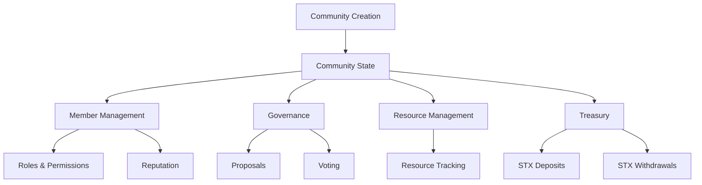

# GameGuard Community Manager

A decentralized platform for creating and managing gaming communities on the Stacks blockchain with transparent governance and secure resource management.

## Overview

GameGuard enables gaming communities to establish decentralized organizations with built-in tools for:

- Community membership management
- Role-based access control
- Democratic governance through proposals
- Treasury management
- Resource tracking
- Reputation systems

The platform provides verifiable on-chain proof of community membership and standing, while ensuring transparent and immutable governance processes.

## Architecture

The system is built around a central smart contract that manages community data and interactions. Here's how the components work together:



### Core Components:

1. **Community Management**: Base structure for creating and configuring communities
2. **Membership System**: Handles member roles, permissions, and reputation
3. **Governance**: Manages proposals and voting mechanisms
4. **Treasury**: Controls community funds
5. **Resource Management**: Tracks community assets and resources

## Contract Documentation

### game-guard.clar

The main contract implementing all GameGuard functionality.

#### Roles

- `ROLE_FOUNDER (u1)`: Community creator with full permissions
- `ROLE_ADMIN (u2)`: Administrative powers
- `ROLE_MODERATOR (u3)`: Moderation capabilities
- `ROLE_MEMBER (u4)`: Basic member permissions

#### Key Functions

**Community Management**
```clarity
(create-community (name (string-ascii 50)) (description (string-utf8 500)) (metadata-url (optional (string-ascii 100))))
(update-community (community-id uint) (name (string-ascii 50)) (description (string-utf8 500)) (metadata-url (optional (string-ascii 100))))
```

**Member Management**
```clarity
(add-member (community-id uint) (new-member principal))
(update-member-role (community-id uint) (member principal) (new-role uint))
(remove-member (community-id uint) (member principal))
```

**Governance**
```clarity
(create-proposal (community-id uint) (title (string-ascii 100)) (description (string-utf8 1000)) (expires-in uint) (execution-params (optional (list 10 {name: (string-ascii 50), value: (string-utf8 200)}))))
(vote-on-proposal (community-id uint) (proposal-id uint) (vote bool))
```

**Treasury Management**
```clarity
(deposit-to-treasury (community-id uint) (amount uint))
(withdraw-from-treasury (community-id uint) (amount uint) (recipient principal))
```

## Getting Started

### Prerequisites

- Clarinet
- Stacks Wallet
- Node.js environment

### Installation

1. Clone the repository
2. Install dependencies:
```bash
clarinet install
```

3. Run tests:
```bash
clarinet test
```

### Basic Usage

1. Create a new community:
```clarity
(contract-call? .game-guard create-community "Gaming Guild" "A community for gamers" none)
```

2. Add members:
```clarity
(contract-call? .game-guard add-member community-id member-address)
```

3. Create a proposal:
```clarity
(contract-call? .game-guard create-proposal community-id "New Game Server" "Proposal to add a new game server" u8640 none)
```

## Function Reference

### Read-Only Functions

```clarity
(get-community (community-id uint))
(get-member (community-id uint) (member principal))
(get-proposal (community-id uint) (proposal-id uint))
(get-resource (community-id uint) (resource-id uint))
```

### Public Functions

```clarity
;; Community Management
(create-community (name (string-ascii 50)) (description (string-utf8 500)) (metadata-url (optional (string-ascii 100))))
(update-community (community-id uint) (name (string-ascii 50)) (description (string-utf8 500)) (metadata-url (optional (string-ascii 100))))

;; Member Management
(add-member (community-id uint) (new-member principal))
(update-member-role (community-id uint) (member principal) (new-role uint))
(remove-member (community-id uint) (member principal))
(update-reputation (community-id uint) (member principal) (new-reputation uint))

;; Governance
(create-proposal ...)
(vote-on-proposal (community-id uint) (proposal-id uint) (vote bool))
(finalize-proposal (community-id uint) (proposal-id uint))

;; Treasury
(deposit-to-treasury (community-id uint) (amount uint))
(withdraw-from-treasury (community-id uint) (amount uint) (recipient principal))
```

## Development

### Testing

The contract includes extensive test coverage. Run tests with:

```bash
clarinet test
```

### Local Development

1. Start Clarinet console:
```bash
clarinet console
```

2. Deploy contract:
```bash
clarinet deploy
```

## Security Considerations

### Access Control
- Role-based permissions enforce proper access control
- Only authorized roles can perform sensitive operations
- Founder role cannot be removed to ensure continuity

### Treasury Security
- Treasury operations require admin privileges
- Balance checks prevent overdraw
- All transactions are recorded on-chain

### Known Limitations
- Proposal execution is manual
- Role elevation requires careful access control
- Treasury limited to STX tokens only